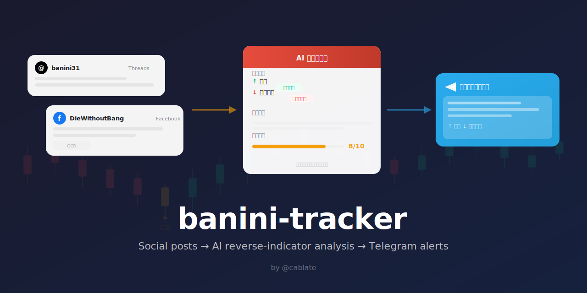
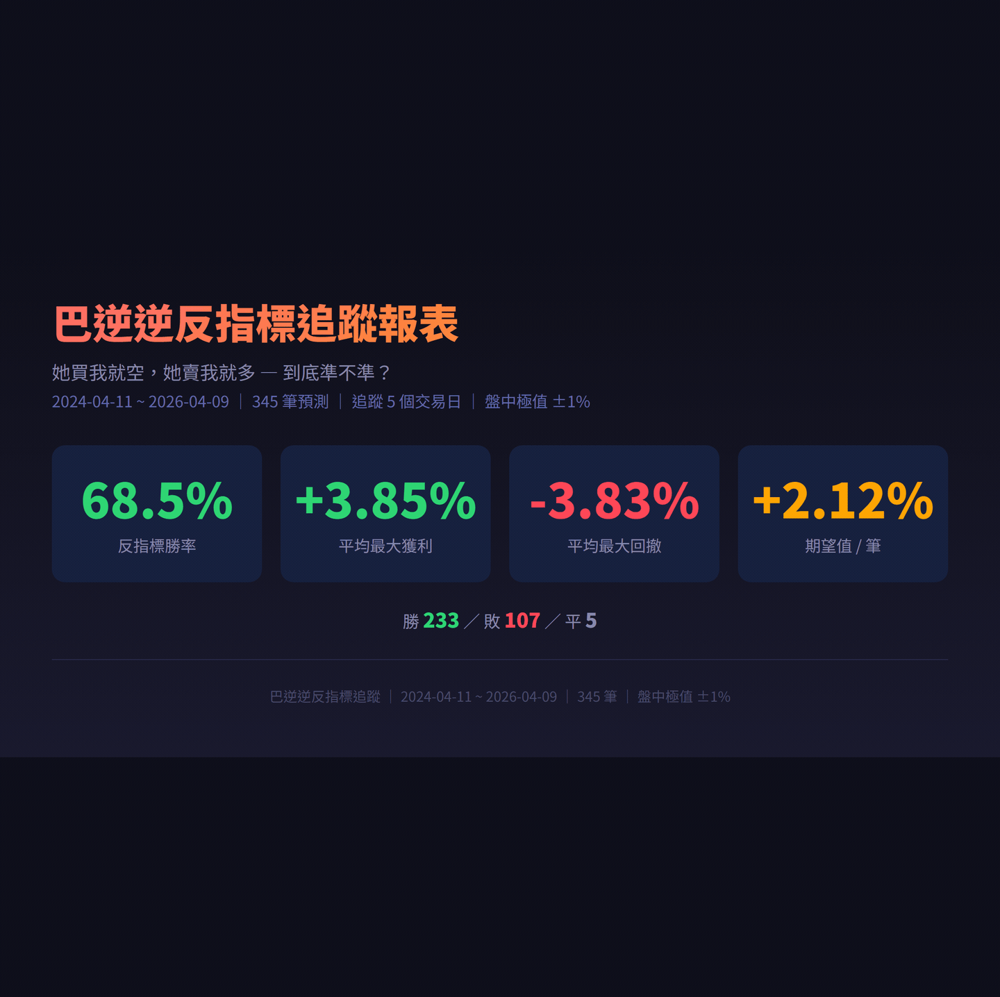

<p align="center">
  
</p>

# banini-tracker

追蹤「股海冥燈」巴逆逆（8zz）的 Facebook 社群貼文，透過 Apify 抓取、AI 反指標分析、Telegram 即時推送，並自動追蹤預測準確度。

- 辨識她提到的標的（個股、ETF、原物料）
- 判斷她的操作（買入 / 被套 / 停損）
- 反轉推導（她停損 → 可能反彈、她買入 → 可能下跌）
- 推導連鎖效應（油價跌 → 製造業利多 → 電子股受惠）
- 自動記錄預測，追蹤 5 個交易日的實際走勢

## 反指標追蹤報表

<p align="center">
  
</p>

> 345 筆預測、5 個交易日追蹤、盤中極值 ±1% 判定。她買我就空，她賣我就多 — 到底準不準？

> **Claude Code 使用者？** 直接把 [`skill/SKILL.md`](skill/SKILL.md) 加到你的 `.claude/skills/` 就能用。Claude 自己當分析引擎，不需要額外 LLM。

支援兩種使用模式：
- **常駐排程**：Docker 部署，自動盤中/盤後排程 + LLM 分析 + Telegram 推送 + 預測追蹤
- **CLI 工具**：`npx @cablate/banini-tracker`，搭配 Claude Code 等 AI 手動執行分析

## 快速開始（常駐排程）

```bash
# 1. 複製設定
cp .env.example .env
# 填入 APIFY_TOKEN, LLM_BASE_URL, LLM_API_KEY, LLM_MODEL, TG_BOT_TOKEN, TG_CHANNEL_ID

# 2. Docker 部署
docker build -t banini-tracker .
docker run -d --name banini --env-file .env -v banini-data:/data banini-tracker

# 3. 或本地直接跑
npm install && npm run start
```

### 排程規則

| 排程 | 時間 | 說明 |
|------|------|------|
| 早晨補漏 | 每天 08:00 | 抓前一晚 22:00 後的貼文（3 篇） |
| 盤中 | 週一~五 09:07-13:07 每 30 分 | 抓 08:30 後的貼文（1 篇） |
| 追蹤更新 | 週一~五 15:00 | 更新預測追蹤（收盤後抓 OHLC） |
| 盤後 | 每天 23:03 | 抓 13:30 後的貼文（3 篇） |

每個排程只抓自己時間窗口內的貼文，搭配 seen.json 去重，確保無死角且不重複。

### npm scripts

| 指令 | 說明 |
|------|------|
| `npm run start` | 常駐排程模式（全部排程自動跑） |
| `npm run dev` | 單次執行（FB 3 篇） |
| `npm run dry` | 只抓取，不呼叫 LLM |
| `npm run market` | 盤中模式（FB 1 篇） |
| `npm run evening` | 盤後模式（FB 3 篇） |

### .env 設定

```
APIFY_TOKEN=apify_api_...
LLM_BASE_URL=https://api.deepinfra.com/v1/openai
LLM_API_KEY=...
LLM_MODEL=MiniMaxAI/MiniMax-M2.5
TG_BOT_TOKEN=...
TG_CHANNEL_ID=-100...

# 影片轉錄（選填，啟用後自動轉錄影片貼文）
TRANSCRIBER=groq
GROQ_API_KEY=gsk_...

# FinMind API（選填，免費可用，註冊可提高額度）
FINMIND_TOKEN=...

# 資料目錄（Docker 建議掛載 /data）
DATA_DIR=/data
```

## 預測追蹤系統

LLM 分析出標的後，系統自動：

1. **映射股票代碼**：台股名稱 → 代碼（2230 檔上市 + 上櫃）
2. **記錄基準價格**：以貼文發佈時間查對應交易日收盤價
3. **追蹤 5 個交易日**：每天 15:00 收盤後抓 OHLC，記錄漲跌幅
4. **同股票取代**：新預測自動取代同標的舊預測（supersede 機制）

勝敗判定在查詢時決定，支援多維度分析（不同持有天數、信心度分群、操作類型）。

### 資料儲存

使用 SQLite（better-sqlite3），資料表：

| 表 | 用途 |
|----|------|
| `posts` | 所有貼文原文（即時 + 歷史回測統一來源） |
| `predictions` | 預測記錄（標的、方向、基準價、狀態） |
| `price_snapshots` | 每日 OHLC 快照（5 天追蹤期） |

資料庫位置：`$DATA_DIR/banini.db`（Docker 掛載 `/data`，本地 `~/.banini-tracker/`）

### 公開資料集

[`data/banini-public.db`](data/banini-public.db) 提供去識別化的預測資料，包含 345 筆預測記錄與對應的價格快照，不含原始貼文內容。可直接用於分析或驗證反指標勝率。

```bash
# 快速查看
sqlite3 data/banini-public.db "SELECT symbol_name, reverse_view, base_price, status FROM predictions LIMIT 10"
```

## CLI 工具模式

不需 clone repo，任何環境直接用：

```bash
# 初始化設定
npx @cablate/banini-tracker init \
  --apify-token YOUR_APIFY_TOKEN \
  --tg-bot-token YOUR_TG_BOT_TOKEN \
  --tg-channel-id YOUR_TG_CHANNEL_ID

# 抓取 Facebook 最新 3 篇
npx @cablate/banini-tracker fetch -s fb -n 3 --mark-seen

# 抓取指定日期區間（回測用）
npx @cablate/banini-tracker fetch --since 2025-04-01 --until 2025-05-01 -n 100

# 推送結果到 Telegram
npx @cablate/banini-tracker push -f report.txt
```

### CLI 指令

| 指令 | 說明 |
|------|------|
| `init` | 初始化設定檔（`~/.banini-tracker.json`） |
| `config` | 顯示目前設定 |
| `fetch` | 抓取貼文，輸出 JSON 到 stdout |
| `push` | 推送訊息到 Telegram |
| `seen list` | 列出已讀貼文 ID |
| `seen mark <id...>` | 標記貼文為已讀 |
| `seen clear` | 清空已讀紀錄 |

### fetch 選項

```
-s, --source <source>  來源：fb（預設 fb）
-n, --limit <n>        每個來源抓幾篇（預設 3）
--since <date>         只抓此時間之後的貼文（YYYY-MM-DD / ISO 時間戳 / 相對時間如 "2 months"）
--until <date>         只抓此時間之前的貼文
--no-dedup             不去重
--mark-seen            輸出後自動標記已讀
```

### push 選項

```
-m, --message <text>     直接帶訊息
-f, --file <path>        從檔案讀取（推薦多行內容用這個）
--parse-mode <mode>      HTML / Markdown / none（預設 HTML）
```

不帶 `-m` 或 `-f` 時從 stdin 讀取。

### 搭配 Claude Code 使用

在 Claude Code 的 skill 中，Claude 自己就是分析引擎：

1. `fetch` 抓貼文 → Claude 讀 JSON
2. Claude 分析 + WebSearch 查最新走勢
3. Claude 組報告 → `push -f` 推送 Telegram

詳見 [`skill/SKILL.md`](skill/SKILL.md)。

## 費用估算

| 項目 | 單次費用 | 頻率 | 月估算 |
|------|---------|------|--------|
| Facebook 抓取（Apify） | ~$0.005/篇 | ~270 篇/月 | ~$1.35 |
| LLM 分析（常駐模式） | 依模型而定 | 同上 | 依模型定價 |
| 影片轉錄（Groq Whisper） | ~$0.006/分鐘 | 視影片數量 | 極低 |
| 股價查詢（FinMind） | 免費 | 每日收盤後 | $0 |
| Telegram 推送 | 免費 | — | $0 |

> CLI 模式搭配 Claude Code 使用不需 LLM 費用，Claude 自己分析。
> 回測歷史資料加日期篩選：~$7/千篇（$5 基本 + $2 date filter add-on）。

## 為什麼只用 Facebook？

早期版本同時支援 Threads 和 Facebook 爬取，後來基於兩個原因移除了 Threads：

1. **費用差距大**：Threads 每次抓取 ~$0.15（Pay-per-event），Facebook 只要 ~$0.02（CU 計費），差 7 倍以上
2. **FB 參考價值更高**：巴逆逆的投資相關貼文（持倉截圖、操作心得）主要發在 Facebook 粉專，Threads 多為生活日常，反指標參考價值較低

## Star History

<a href="https://star-history.com/#cablate/banini-tracker&Date">
 <picture>
   <source media="(prefers-color-scheme: dark)" srcset="https://api.star-history.com/svg?repos=cablate/banini-tracker&type=Date&theme=dark" />
   <source media="(prefers-color-scheme: light)" srcset="https://api.star-history.com/svg?repos=cablate/banini-tracker&type=Date" />
   
 </picture>
</a>

## 免責聲明

本專案僅供娛樂參考，不構成任何投資建議。

## License

MIT
